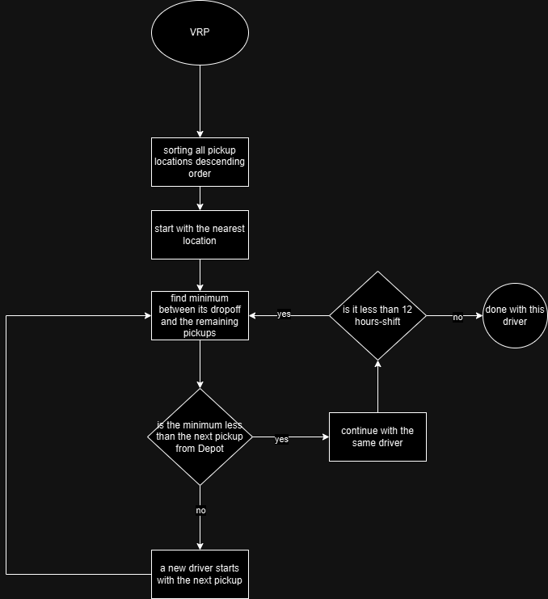

# vrp
Vehicle Routing Problem (VRP)

Algorithm Idea: Sort loads by pickup location distance from depot. Start with the closest pickup location with one or multiple drivers well distributed within the sorted pickup locations such as top, bottom, and middle. For the next load, find the shortened distance from the existing drivers’ drop-off location to the remaining pickup compared to the distance from depot for adding a new driver. Continue until there are no loads left.



Build executable file from root directory
```bash
go build .
chmod +x vrp
./vrp
```
Evaluate with training problems from root directly
```bash
python3 evaluateShared.py --cmd ./vrp --problemDir problems
```

